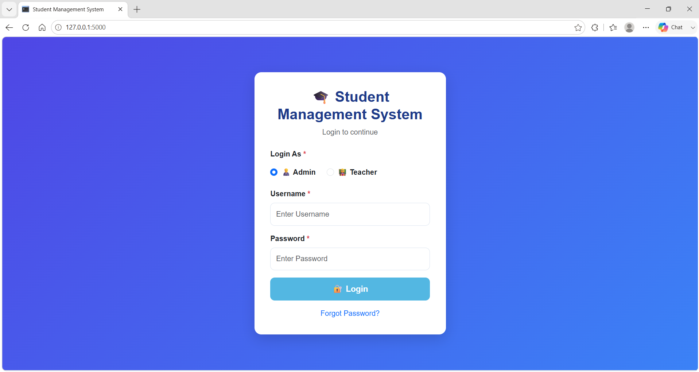
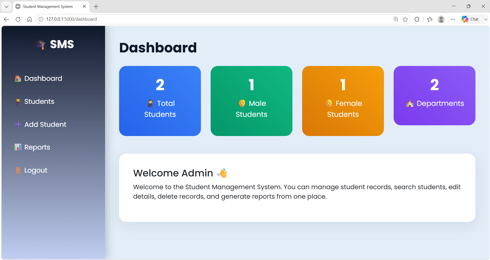
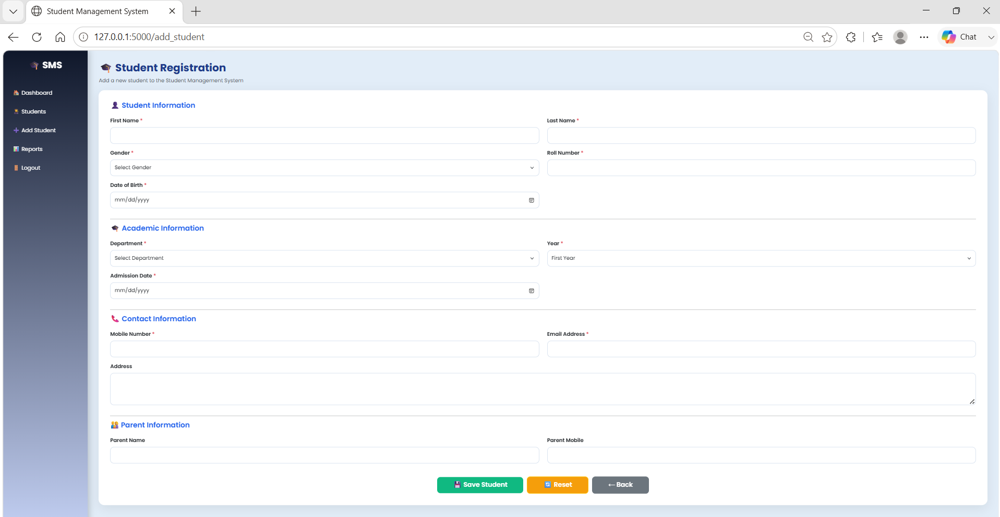
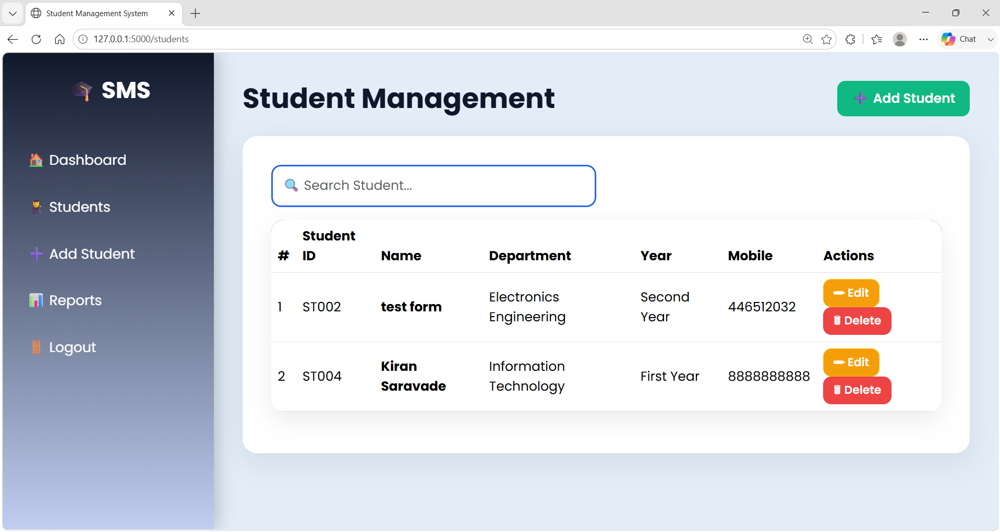
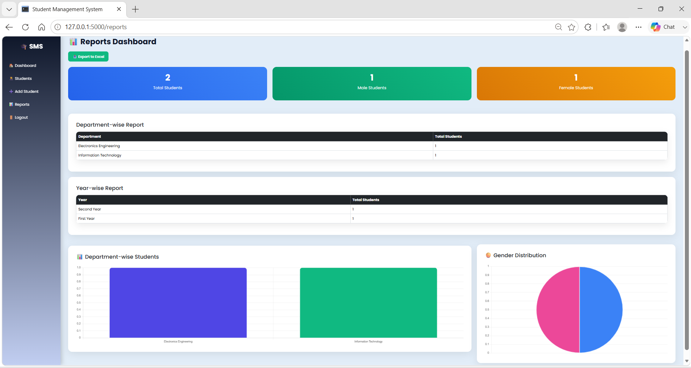
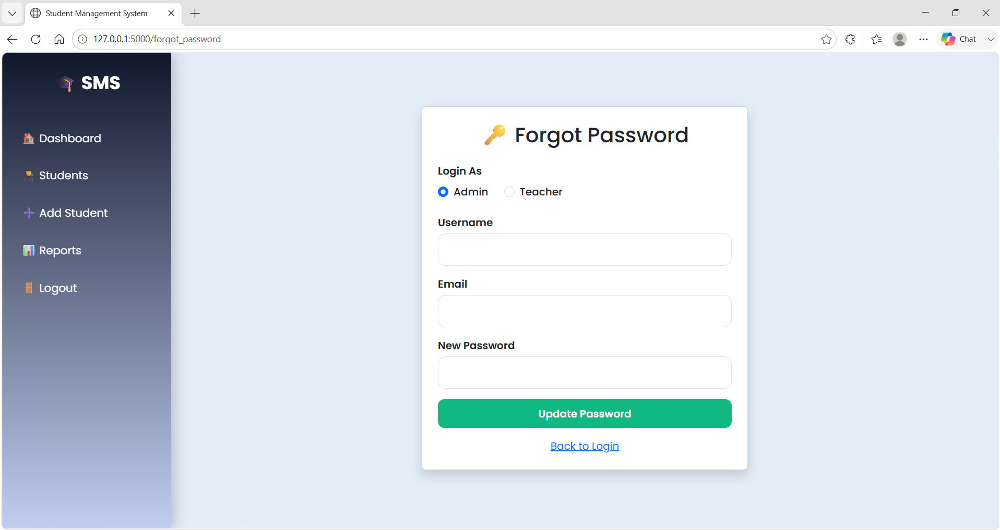
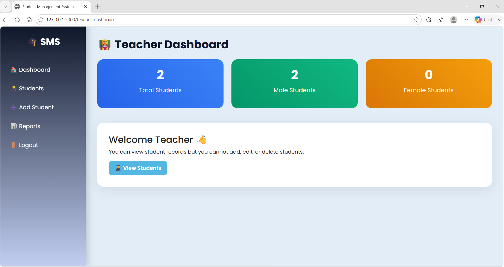
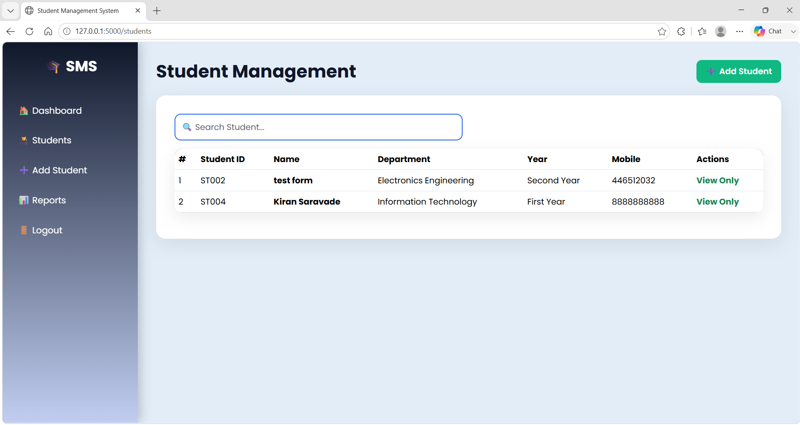

# 🎓 Student Management System

A modern and responsive **Student Management System** developed using **Flask, Python, MySQL, Bootstrap, Chart.js, and OpenPyXL**. The system provides secure role-based access for administrators and teachers, allowing efficient student record management and report generation.

---

## 🚀 Features

### 🔐 Authentication
- Admin Login
- Teacher Login
- Forgot Password
- Role-Based Access Control
- Secure Session Management
- Logout Functionality

### 👨‍🎓 Student Management
- Add Student
- Edit Student
- Delete Student
- View Student Records
- Search Students
- Auto-Generated Student ID

### 👨‍🏫 Teacher Module
- Teacher Dashboard
- View Student Records
- Restricted Access (Teachers cannot Add, Edit, Delete, or Export student data)

### 📊 Reports & Analytics
- Dashboard Statistics
- Department-wise Student Report
- Year-wise Student Report
- Department-wise Bar Chart
- Gender Distribution Pie Chart
- Export Student Records to Excel

### 💻 User Interface
- Responsive Dashboard
- Professional Login Page
- Attractive Add Student Form
- Modern Sidebar Navigation
- Mobile-Friendly Design

---

## 🛠️ Technologies Used

- Python
- Flask
- MySQL
- HTML5
- CSS3
- Bootstrap 5
- JavaScript
- Chart.js
- OpenPyXL

---

# 📸 Project Screenshots

## 🔐 Login Page (Admin / Teacher Login)


---

## 📊 Admin Dashboard


---

## ➕ Add Student Form


---

## 👨‍🎓 Student List


---

## 📈 Reports Dashboard


---

## 🔑 Forgot Password


---

## 👨‍🏫 Teacher Dashboard


---

## 👨‍🏫 Teacher - View Students


---

## ▶️ Installation

```bash
git clone https://github.com/kiru-08/Student-Management-System.git

cd Student-Management-System

python -m pip install -r requirements.txt

python app.py
```

---

## 🗂️ Database

Create a MySQL database named:

```sql
StudentDB
```

Import the required tables:

- admin
- teachers
- students

Update your MySQL credentials inside:

```
database.py
```

---

## 👨‍💻 Author

**Kiran Saravade**

🔗 LinkedIn: https://www.linkedin.com/in/kiran-saravade

🐙 GitHub: https://github.com/kiru-08

---

## ⭐ Future Enhancements

- 👤 Student Photo Upload
- 📷 QR Code-based Student ID & Verification
- 🪪 Student ID Card Generation
- 📄 PDF Report Generation
- 📊 Attendance Management System
- 📝 Marks & Result Management
- 👨‍🏫 Teacher Management Module
- 📧 Email Notifications
- 📥 Bulk Student Import (Excel/CSV)
- 🔒 Password Encryption (Hashed Passwords)
- 🔑 OTP-based Password Reset
- 👥 Multi-role Access (Admin, Teacher, Student)